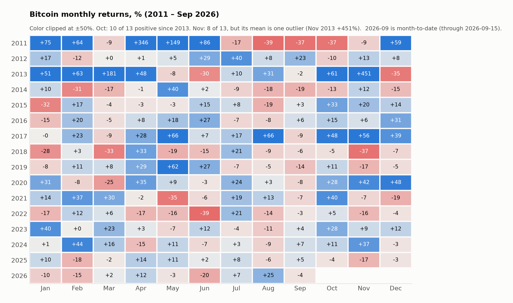
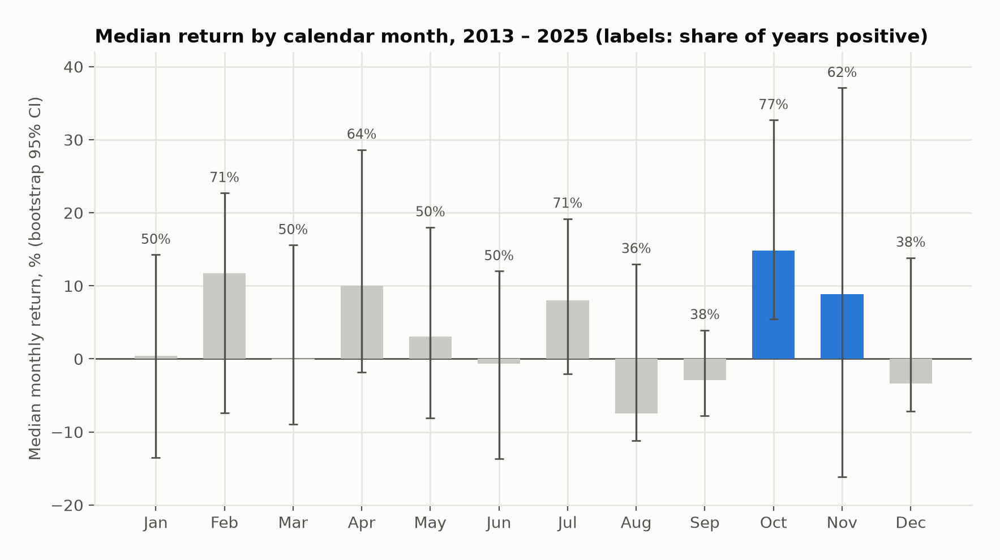
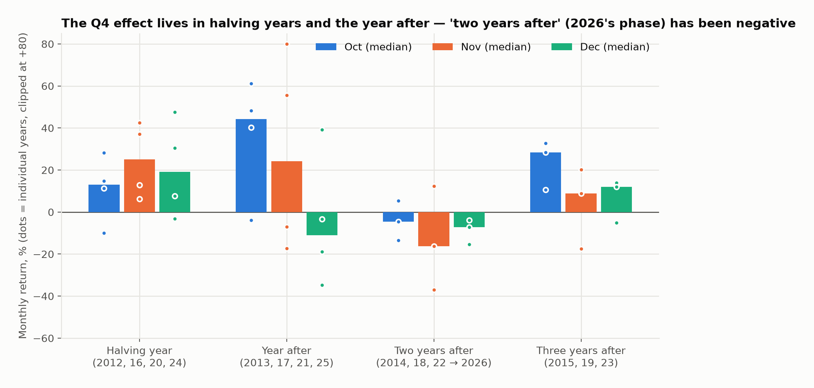
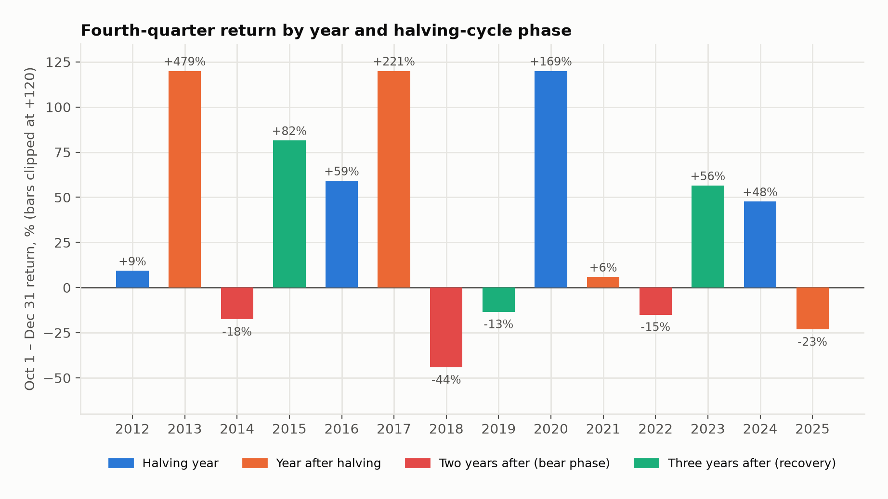
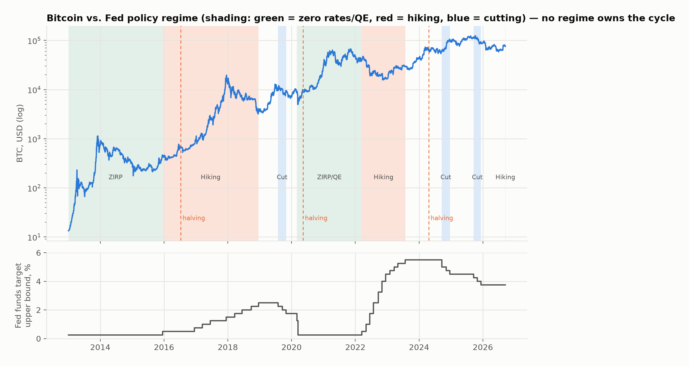
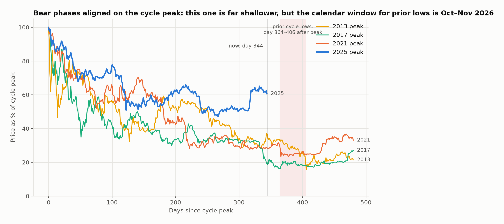
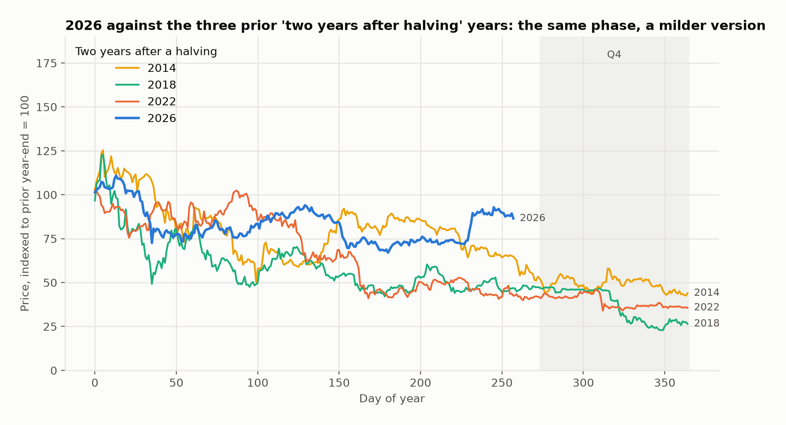

# Bitcoin's October–November pattern: what drives it, and what it implies for Q4 2026

*Analysis date: 21 September 2026. Daily prices through 15 September 2026 (last close $75,686). Spot on 18 September was about $78,000.*

This is a data study, not investment advice. Every number below is reproducible from the files in this folder (`build_dataset.py`, `analyze.py`, `charts.py`; tables in `results/`, figures in `charts/`).

---

## 1. The verdict in one page

1. **October's edge is real but modest. November's is mostly a legend.** Since 2013, October closed higher in 10 of 13 years (median +14.8%, bootstrap 95% CI on the median +5% to +33%). November was positive in only 8 of 13; its famous +41% average is one outlier (November 2013, +451%). Strip that year out and November's median is about +8% with a 7-of-12 hit rate. December has a *negative* median (−3.4%, 5 of 13 positive).
2. **The pattern is a halving-cycle effect wearing a calendar costume.** Bitcoin's three big cycle peaks all landed in Q4 of the year after a halving (Dec 2013, Dec 2017, Nov 2021). Those years alone (plus 2025) carry the Q4 average. Take the "year after halving" out and October's mean drops from +20% to +6% (median +10%); November's mean drops from +41% to +5%.
3. **The timeline that matters is four years, not two, three or five.** Grouping annual returns by position in a 4-year cycle explains 56% of the variance of annual returns (adjusted R² 0.42, permutation p = 0.032). Two-, three-, five- and six-year groupings explain nothing (p = 0.13, 0.71, 0.96, 0.71). A periodogram of the detrended log price peaks at 44 months.
4. **The Fed is not the driver.** Bitcoin's 12-month return has a −0.05 correlation with the 12-month change in the Fed funds rate. In the 21 trading days after a rate *cut*, Bitcoin's median return was −5.7% (n = 11 cuts); after a hike, −2.6% (n = 20). The best Q4s happened under zero rates (2013, 2020), under hiking (2017) and under cutting (2024) alike. Cuts in Q4 2019 and Q4 2025 coincided with *falling* prices.
5. **2026 is in the phase that has been Bitcoin's worst.** 2026 is "two years after a halving" (like 2014, 2018, 2022). In those three years Q4 was −18%, −44% and −15%; November was negative in two of the three (−37% in 2018, −16% in 2022) and December in all three. Prior cycle lows came 364–406 days after the peak; for the 6 October 2025 peak that window is **5 October – 16 November 2026**.
6. **But this cycle is much milder, and price is entering Q4 in better shape than any prior "year two".** The drawdown so far is −53% (June low $58,654) against −77%, −84% and −85% in prior cycles. Price is 7.7% above its 200-day average after a +25% August, something no prior year-two had on 30 September. The realistic expectation is not a 2018-style collapse; it is a Q4 that is a near coin flip with two-sided November risk, and a cycle low that is either already in (June) or gets retested in the October–November window.

**Probabilities I would put on Q4 2026** (judgment informed by the base rates in sections 3–6, not a model output):

| Outcome | Probability |
|---|---|
| October 2026 closes above its 30 September close | ~60% |
| October + November combined is positive | ~50% |
| Q4 (1 Oct – 31 Dec) is positive | ~45% |
| A daily close below the June low ($58,654) at some point in Q4 | ~30% |
| Year-end close above the 2025 close ($87,517), i.e. 2026 finishes up | ~25% |
| New all-time high (> $124,824 close) before year-end | < 5% |

The single most useful historical statement: in every prior cycle the strong, low-risk part of the pattern began in the *third* year after the halving (2015 +34%, 2019 +94%, 2023 +156%), after a Q4/January low in year two. If the cycle template holds even in dampened form, the interesting window is weakness between mid-October 2026 and January 2027, not "buy on 1 October".

---

## 2. Data and method

| Item | Source | Notes |
|---|---|---|
| Daily BTC/USD, 2010-07-18 → 2026-05-23 | Coin Metrics community data (`PriceUSD`, CC BY-NC 4.0) | primary series |
| Daily BTC/USD, 2026-05-24 → 2026-09-15 | Habrador/Bitcoin-price-visualization (GitHub) | validated against Coin Metrics on 4,891 overlapping days: median abs. difference 0.24%, mean difference 0.0%. Month-end closes also cross-checked against press quotes (30 Jun $58,654 vs reported $58,566; 31 Aug $78,629 vs reported $78,414). |
| Fed funds target changes and FOMC dates, 2008–2026 | Federal Reserve press releases (compiled in `data/fed_policy_changes.csv`, `data/fomc_meetings.csv`) | includes the 16 Sep 2026 hike to 3.75–4.00% |
| Halving dates | Bitcoin block heights 210k / 420k / 630k / 840k | 2012-11-28, 2016-07-09, 2020-05-11, 2024-04-20 |
| ETH daily (cross-check), S&P 500 monthly (Shiller, context) | Coin Metrics; datasets/s-and-p-500 | |

Method: monthly returns from month-end closes (2011-01 to 2026-08 complete; September 2026 is month-to-date and shown but excluded from statistics). Per-month statistics use mean, median, hit rate, a t-test on log returns, a Wilcoxon signed-rank test, and 20,000-sample bootstrap confidence intervals. Because "is October special?" involves twelve looks at the data, a **max-|t| permutation test** gives a family-wise p-value that accounts for the multiple comparisons. Cycle phase is the calendar year's position relative to the most recent halving (halving year = H, then H+1, H+2, H+3). Fed regimes are classified from the target-rate path (zero-rate/QE, hiking cycle, hold at peak, cutting, hold after cuts).

---

## 3. Is the seasonal pattern real?





**Monthly statistics, 2013–2025** (`results/month_stats_2013_2025.csv`):

| Month | n | Mean | Median | Positive | t-test p (log) | Wilcoxon p | Median 95% CI |
|---|---|---|---|---|---|---|---|
| Jan | 14 | +3.4% | +0.4% | 50% | 0.91 | 0.81 | −14% … +14% |
| Feb | 14 | +11.2% | +11.7% | 71% | 0.22 | 0.14 | −7% … +23% |
| Mar | 14 | +12.2% | −0.1% | 50% | 0.58 | 0.86 | −9% … +16% |
| Apr | 14 | +12.2% | +10.0% | 64% | 0.05 | 0.08 | −2% … +29% |
| May | 14 | +9.0% | +3.1% | 50% | 0.46 | 0.43 | −8% … +18% |
| Jun | 14 | −2.1% | −0.7% | 50% | 0.48 | 0.76 | −14% … +12% |
| Jul | 14 | +7.9% | +8.0% | 71% | **0.03** | **0.03** | −2% … +19% |
| Aug | 14 | +2.7% | −7.4% | 36% | 0.92 | 0.81 | −11% … +13% |
| Sep | 13 | −3.2% | −2.9% | 38% | 0.16 | 0.22 | −8% … +4% |
| **Oct** | 13 | **+20.0%** | **+14.8%** | **77%** | **0.007** | **0.008** | **+5% … +33%** |
| Nov | 13 | +41.4% | +8.9% | 62% | 0.28 | 0.27 | −16% … +37% |
| Dec | 13 | +4.0% | −3.4% | 38% | 0.82 | 0.89 | −7% … +14% |

What survives scrutiny:

- **October** is the only month whose confidence interval excludes zero. Its single-test p-value is 0.007, but after correcting for twelve looks the family-wise p-value is **0.11**: suggestive, not proof. Start the sample in 2011 instead of 2013 (adding October 2011 at −37% and October 2012 at −10%) and October's median falls to +11% with a 67% hit rate and p = 0.11 even before correction. The effect is real-looking but fragile to two data points.
- **November** is not statistically distinguishable from zero on any test. Its mean is dominated by 2013; its median (+9%) comes with a −16% to +37% interval. It is the highest-volatility month of the year after December (annualized realized volatility 86% vs 56% in October, chart 08). November is where the big moves happen in both directions: +451% (2013), +56% (2017), +42% (2020), +37% (2024) but also −37% (2018), −18% (2019), −16% (2022), −17% (2025).
- **December** is negative-median. The "year-end rally" is not in the Bitcoin data.
- **October is the calmest month.** Realized volatility is lowest in September–October and jumps in November–December. "Uptober" has historically been a low-volatility drift, not a blow-off.
- **July** is the second-best month (71% positive, p = 0.03) and gets none of the attention. April is third.
- **The best two-month window by hit rate is not Oct–Nov.** Windows ending in October (Sep–Oct) were positive 73% of the time; windows ending in May–July 69%; windows ending in November only 60%. Oct–Nov has the highest *mean* two-month log return (+25%) purely because of 2013.

Cross-checks against the "it's just crypto seasonality" story:

- **Ether (2016–2025)** shows almost no October effect: median +1.3%, 60% positive; November median −4.2%. Whatever drives Bitcoin's October is not a generic crypto calendar.
- **S&P 500 (1950–2026, monthly averages)**: October's mean is −0.06%; the equity seasonal is November–January and April. Bitcoin's October is not inherited from stocks.

---

## 4. Which timeline? Two, three, four or five years

You asked whether the pattern is tied to a 2-, 3- or 5-year benchmark. It is tied to four, and the reason is the halving.

**Variance of annual returns explained by cycle position** (`analyze.py`, permutation test with 10,000 shuffles, 2012–2025, the years with a clean halving phase):

| Grouping | R² | Adjusted R² | Permutation p |
|---|---|---|---|
| 2-year | 0.18 | 0.11 | 0.13 |
| 3-year | 0.06 | −0.11 | 0.71 |
| **4-year** | **0.56** | **0.42** | **0.032** |
| 5-year | 0.07 | −0.35 | 0.96 |
| 6-year | 0.28 | −0.17 | 0.71 |

The 2-year grouping's weak signal is an alias of the 4-year one (odd years H+1/H+3 vs even years H/H+2). A Lomb–Scargle periodogram of the detrended log price peaks at **44 months**, with the top five periods all between 42 and 46 months.

Average annual return by phase (geometric mean, 2012–2025): halving year +176%, year after +483%, **two years after −65%**, three years after +88%.

---

## 5. The halving cycle explains the calendar





**The four cycles** (`results/halving_cycles.csv`, daily closes):

| Halving | Price at halving | Cycle peak | Days to peak | Gain | Cycle low | Days peak → low | Drawdown |
|---|---|---|---|---|---|---|---|
| 2012-11-28 | $12.3 | 2013-12-04, $1,135 | 371 | 91× | 2015-01-14, $176 | 406 | −85% |
| 2016-07-09 | $652 | 2017-12-16, $19,640 | 525 | 29× | 2018-12-15, $3,185 | 364 | −84% |
| 2020-05-11 | $8,592 | 2021-11-08, $67,542 | 546 | 6.9× | 2022-11-09, $15,758 | 366 | −77% |
| 2024-04-20 | $64,908 | 2025-10-06, $124,824 | 534 | 1.9× | 2026-06-30, $58,654 *(so far)* | 267 *(so far)* | −53% *(so far)* |

Two facts fall out of this table:

- **Three of four cycle peaks were in Q4 of the post-halving year, and the fourth (2025) was on 6 October.** That is why the Q4 averages are enormous: October 2013 +61% and November 2013 +451%; October–December 2017 +48%, +56%, +39%; October 2021 +40%. Those months are the cycle, not the calendar.
- **Peaks are arriving at a stable lag (525–546 days in the last three cycles) but with collapsing amplitude** (91× → 29× → 6.9× → 1.9×) and shallower busts (−85% → −84% → −77% → −53% so far). The cycle is dampening as the asset matures, which matters for the 2026 forecast.

**October, November and December by cycle phase** (`results/month_stats_by_cycle_year.csv`, 2012–2025):

| Phase (years) | Oct median | Oct positive | Nov median | Nov positive | Dec median | Dec positive | Q4 median | Q4 positive |
|---|---|---|---|---|---|---|---|---|
| Halving year (2012, 16, 20, 24) | +13.0% | 3/4 | +25.0% | 4/4 | +19.1% | 3/4 | +53% | 4/4 |
| Year after (2013, 17, 21, 25) | +44.3% | 3/4 | +24.2% | 2/4 | −11.1% | 1/4 | +114% | 3/4 |
| **Two years after (2014, 18, 22)** | **−4.5%** | **1/3** | **−16.2%** | **1/3** | **−7.2%** | **0/3** | **−18%** | **0/3** |
| Three years after (2015, 19, 23) | +28.4% | 3/3 | +8.9% | 2/3 | +11.9% | 2/3 | +57% | 2/3 |

**Decomposing "Uptober"** (`results/summary.json → oct_nov_decomposition`):

| Sample | Oct mean | Oct median | Oct positive | Nov mean | Nov median | Nov positive |
|---|---|---|---|---|---|---|
| All years 2013–2025 (n = 13) | +20.0% | +14.8% | 77% | +41.4% | +8.9% | 62% |
| Excluding the year after each halving (n = 11) | +6.1% | +10.5% | 64% | +5.5% | +8.9% | 64% |
| Two years after a halving only (n = 3) | −4.2% | −4.5% | 33% | −13.6% | −16.2% | 33% |

So: outside the post-halving blow-off years, October still leans positive (about two years in three, median about +10%) but it is an ordinary good month, on par with February, April and July. The specific phase 2026 is in has produced negative Octobers and Novembers.

**Why would a calendar effect exist at all, once the cycle is removed?** The candidates that fit the data:

1. **Volatility seasonality.** Q3 is the quietest quarter of the year (chart 08). When volatility re-expands in Q4 it does so in the direction of the prevailing trend, which in most sample years was up. This is consistent with October being strongest in years that entered it with positive year-to-date returns (89% positive) and weak in years that entered it underwater (50%).
2. **Reflexivity.** "Uptober" became a trading meme around 2020–2021; a widely believed seasonal in a retail-heavy, momentum-driven market can mildly self-fulfil. This fits the persistence of a ~+10% October drift outside blow-off years and its low volatility (buying is steady rather than panicked).
3. **Year-end positioning in bear years.** Tax-loss selling and fund redemptions explain why November–December are the worst months in "year two" (2014, 2018, 2022) and why December has a negative median overall.

What does *not* fit: institutional year-end allocations (December would be positive), and equity seasonality (see section 3).

---

## 6. The Fed: tested three ways, mostly acquitted



**Monthly Bitcoin returns by Fed regime, 2011 – Aug 2026** (`results/monthly_returns_by_fed_regime.csv`):

| Regime | Months | Mean | Median | Positive | Annualized vol |
|---|---|---|---|---|---|
| Zero rates / QE (2011–15, 2020–22) | 83 | +21.4% | +7.6% | 58% | 244% |
| Hiking cycle (2016–18, 2022–23, Sep 2026–) | 52 | +6.5% | +4.2% | 56% | 83% |
| Hold at peak rate (2019 H1, Aug 2023–Sep 2024) | 21 | +9.8% | +8.0% | 67% | 68% |
| Cutting (2019, late 2024, late 2025) | 9 | +1.6% | −3.9% | 44% | 57% |
| Hold after cuts (2020 Q1, 2025, 2026 to Sep) | 23 | +0.9% | −2.1% | 48% | 46% |

The zero-rate era looks spectacular only because it contains 2011–2013, when Bitcoin went from $0.30 to $1,000. Within the modern sample, **the best regime was "Fed on hold at a high rate"** (2019 H1 rally, the 2023–24 ETF rally) and **the worst was "Fed cutting"**. Cuts have not been bullish for Bitcoin.

**FOMC decision-day event study, 2013–2026** (`results/fomc_event_study.csv`; returns from the close before the decision):

| Decision | n | 2-day mean | 2-day median | 21-day mean | 21-day median | 21-day positive |
|---|---|---|---|---|---|---|
| Cut | 11 | −0.4% | −0.2% | −1.7% | **−5.7%** | 45% |
| Hike | 20 | −0.1% | −0.2% | −1.5% | −2.6% | 45% |
| Hold | 79 | +0.4% | +0.0% | +10.6% | +3.6% | 58% |
| *Any 22-day window (unconditional)* | | | | +3.9% | | |

Rate cuts have been "sell the news" events for Bitcoin more often than not. The three cutting episodes in Q4: **2019** (cuts in Sep and Oct, Bitcoin −14% in Q4), **2024** (cuts in Sep, Nov, Dec, Bitcoin +48%, but driven by the election and ETF flows), **2025** (cuts in Sep, Oct, Dec, Bitcoin −23%). Two of three Q4 cutting episodes were down quarters.

**Correlation of Bitcoin's 12-month return with the 12-month change in the policy rate (2013–2026, n = 165 months): −0.05** (Spearman −0.08). Rate direction explains essentially nothing about Bitcoin's trend at the one-year horizon.

Two caveats. First, this tests the *policy rate*, not liquidity. The popular "global M2 leads Bitcoin by ~10–12 weeks" charts were not tested here (no M2 series in this dataset); those relationships are notoriously sensitive to the chosen lag and sample, but they are a better-motivated channel than the Fed funds rate itself. Second, the September 2026 hike is the first tightening move since 2023 and comes with guidance for possibly one more this year. Hiking regimes historically had *positive* median Bitcoin months (+4.2%), but the two prior Q4s that fell inside hiking cycles and year-two phases at the same time (2018, 2022) were the worst Q4s in the sample (−44%, −15%). The Fed did not cause those; the cycle phase did, and the Fed did not rescue them.

---

## 7. Where 2026 sits right now





**State on 15 September 2026** (`results/sept30_state_vs_q4.csv`):

| Indicator | Value | Comparable years on 30 Sep |
|---|---|---|
| Price | $75,686 | |
| Cycle phase | two years after the 2024 halving | 2014, 2018, 2022 |
| Days since cycle peak (6 Oct 2025) | 344; price is 61% of peak | at day 344 prior cycles were at 37%, 20%, 29% of peak |
| Drawdown from all-time high | −39% | 2013, 14, 15, 16, 18, 19, 20, 21, 22, 23 were worse than −30% |
| Year-to-date | −13.5% | 2014 (−47%), 2015 (−26%), 2018 (−53%), 2022 (−58%) |
| Trailing 12 months | −34% | only 2015 (−39%) and 2022 (−56%) were negative |
| vs 200-day moving average (~$70,300) | +7.7% above | above in 2013, 16, 17, 20, 25; below in all prior year-two years |
| 2026 path | Jan −10%, Feb −15%, Mar +2%, Apr +12%, May −3%, Jun −20%, Jul +7%, Aug +25%, Sep −4% (to 15th) | Q1 −22%, Q2 −14%, Q3 +29% to date |
| Macro | Fed hiked 25bp on 16 Sep to 3.75–4.00% (12–0), dots imply one more in 2026; next FOMC 27–28 Oct and 8–9 Dec | Spot ETFs net negative YTD after a record outflow streak in late May/June; Strategy's first BTC sale since 2022 |

**Conditional base rates for Q4, given the 30 September state (2013–2025):**

| Condition on 30 Sep | Years | Oct positive | Nov positive | Q4 positive | Q4 median |
|---|---|---|---|---|---|
| Year-to-date negative | 2014, 15, 18, 22 | 2/4 | 2/4 | **1/4** | **−16%** |
| Year-to-date positive | 9 years | 8/9 | 6/9 | 7/9 | +56% |
| Above 200-day average | 2013, 16, 17, 20, 25 | 4/5 | 4/5 | 4/5 | +169% |
| Below 200-day average | 8 years | 6/8 | 4/8 | 4/8 | −4% |
| Trailing 12-month return negative | 2015, 22 | 2/2 | 1/2 | 1/2 | (+81%, −15%) |
| Two years after a halving | 2014, 18, 22 | 1/3 | 1/3 | 0/3 | −18% |

2026 sits on both sides of these tables: it looks like a year-two bear year on the calendar, on year-to-date return and on the cycle clock, but it enters Q4 with momentum (above the 200-day average, +29% off the June low) that no prior year-two had. The prior "trailing-12-month-negative" Octobers (2015 +33%, 2022 +5%) were both positive, which is the best argument for a decent October; the prior year-two Novembers (2018 −37%, 2022 −16%) are the best argument for caution in November.

**The peak-aligned analog is the part most worth internalizing.** Measured from each cycle peak, the final lows came on day 364, 366 and 406. From the 6 October 2025 peak, those days are 5 October, 7 October and 16 November 2026. From the equivalent of today (day 344), the next 107 days in prior cycles saw drawdowns of −19% (2018), −19% (2022) and −58% (2014–15) before the low. Applied to $76k, a −19% move retests the June low almost exactly ($61–62k). The 2014–15 depth is not a realistic template for an asset with spot ETFs and a −53% bear already behind it, but the *timing* signature is what the pattern actually says about "October–November".

---

## 8. What to expect in Q4 2026: three scenarios

**A. Range and grind (about 40%).** October drifts up toward $80–90k on low volatility, as most Octobers do; November is two-way; the year closes between $70k and $90k. This is the modal outcome because the two strongest forces (year-two phase pulling down, momentum and shallow drawdown holding up) roughly offset. Signposts: ETF flows flat-to-positive, Fed holds on 28 October or a hike is already priced, the 200-day average (~$70k) holds on any dip.

**B. Cycle-template washout (about 35%).** A November-led decline retests or undercuts the June low ($55–62k) between mid-October and January, marking the cycle low, followed by the year-three recovery pattern (2015 +34%, 2019 +94%, 2023 +156%). Signposts: loss of the 200-day average and $70k on a weekly close, ETF outflows resuming for two-plus weeks, a second Fed hike in October or December with hawkish guidance, rising real yields and dollar. Note that in 2022 the June low was undercut by 10% in November; in 2018 the February low was undercut by 47% in November–December; in 2014–15 the spring low was undercut by half. Undercuts of the mid-year low are the norm in year two.

**C. "Uptober" breakout (about 25%).** Price reclaims the 2025 close ($87.5k, which erases the year's loss) in October and trades to $95–105k by year-end. Signposts: three-plus consecutive weeks of net ETF inflows, the Fed signalling the September hike was one-and-done, a weekly close above the early-September high (~$81k) followed by an October close above $87.5k. This is what the raw calendar statistics would predict; it is discounted here because the calendar's power comes from a phase the market is not in.

Levels that matter, in order: **$87,517** (2025 close; above it the year is positive and scenario C is live), **~$81,000** (September high), **~$70,300** (200-day average; below it on a weekly close scenario B is live), **$58,654** (June closing low), **$55,000** (a 10% undercut of the June low, the 2022-style outcome).

What would make me change the probabilities: sustained ETF inflows (raises C), a Fed pivot back to cuts without recession (raises C), a loss of the 200-day average in October (raises B sharply), or an October close above $90k (the cycle template would then have failed in a way it has not before, and the "dampened cycle" reading would move to "cycle broken").

---

## 9. Caveats, stated plainly

- **Sample size.** Thirteen Octobers, three "year-two" years, nine months of Fed cuts. Every conditional table above has a handful of observations. Treat the numbers as base rates that organize thinking, not as probabilities with decimals.
- **Multiple comparisons.** October's headline p-value (0.007) becomes 0.11 once you account for having looked at twelve months. November has no statistically detectable effect at all.
- **The cycle is changing.** Peak gains have fallen from 91× to 1.9× and drawdowns from −85% to −53%. Spot ETFs (since January 2024), corporate treasuries and a much larger holder base mean the 2014/2018/2022 analogs are templates for *timing and direction*, not for magnitude. The 2025 cycle peak (+92% from the halving, no Q4 blow-off, negative October and November in a post-halving year) is itself evidence that the old template is weakening.
- **Data splice.** The last four months come from a secondary daily source that tracks Coin Metrics to within 0.24% on average; month-end closes were verified against independent quotes.
- **Fed dates.** FOMC decision dates were compiled from memory of the published calendars and press releases and verified for 2025–2026; a one-day error on an old meeting would not change the event-study conclusions.
- **Nothing here is investment advice.** It is a description of what the record shows and a probabilistic reading of where the record says we are.

---

## 10. Reproduce

```bash
pip install pandas numpy scipy matplotlib
python3 build_dataset.py   # merges the two raw price sources into data/btc_daily.csv
python3 analyze.py         # writes results/*.csv and results/summary.json
python3 charts.py          # writes charts/*.png
```

Key result files: `results/month_stats_2013_2025.csv`, `results/month_stats_by_cycle_year.csv`, `results/window_returns_by_year.csv`, `results/halving_cycles.csv`, `results/peak_aligned_paths.csv`, `results/monthly_returns_by_fed_regime.csv`, `results/fomc_event_study.csv`, `results/sept30_state_vs_q4.csv`, `results/summary.json` (all headline numbers, the permutation and periodicity tests, and the conditional base rates).
